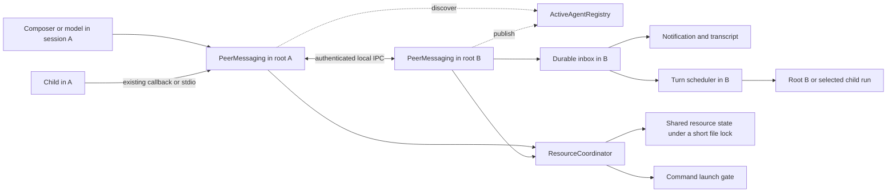

# Local peer communication and build coordination

Date: 2026-09-09

Status: Draft following a source and test audit; proposed behavior is not implemented.

Audit baseline: `a03584f6`, including the staged agent-runtime changes present in this worktree.

## Recommendation

Extend existing peer discovery with authenticated, versioned JSON-RPC 2.0 over
Unix domain sockets on macOS/Linux and named pipes on Windows. Give each root CLI
process an endpoint, and route its child agents through that root. Add peer tools
for the model, `:` recipient selection in the composer, and a separate resource
coordination module that can enforce build priority before a process starts.

This addresses independent Autohand sessions on the same machine, including sessions
in different projects and linked worktrees. It also lets their participating workers
send and receive messages. It does not require replacing the existing child runtime.

The [August agent-runtime draft](plans/2026-08-11-agent-run-runtime-design.md) explicitly
deferred cross-session messaging. This document designs that extension against the
current implementation. Its older inventory of missing child capabilities is no
longer a reliable description of this worktree. This draft does not adopt the older
proposal's entire `rlm`, worktree, or lifecycle migration.

## What exists today

| Area | Current implementation and evidence | Consequence for this feature |
| --- | --- | --- |
| Presence | [ActiveAgentRegistry](../src/session/ActiveAgentRegistry.ts), `ActiveAgentHeartbeat`: records under `$AUTOHAND_HOME/active-agents`, a 5-second heartbeat, 15-second staleness threshold, PID checks, private directory/file modes. | Reuse discovery and the existing heartbeat. The record has no messaging address, live process incarnation, inbox, or delivery capability. Presence is only a hint about reachability. |
| Awareness scope | [PeerAwarenessManager](../src/session/peers/PeerAwarenessManager.ts), `performRefresh`: excludes the current session and filters by `path.resolve(workspaceRoot)` equality. | Machine-wide records already exist, but `/peers` currently shows the exact workspace. Different worktrees are not grouped by repository identity. `path.resolve` also does not canonicalize symlinks. |
| Activity and claims | [PeerActivityPublisher](../src/session/peers/PeerActivityPublisher.ts), [PeerWarnings](../src/session/peers/PeerWarnings.ts), [ActionExecutor](../src/core/actionExecutor.ts): bounded activity text, recent writes, Git drift, and coordinate-mode file claims. | Claims produce warnings/confirmation and can be bypassed by existing auto-confirm settings. They are not an atomic mutex or a build reservation. |
| User discovery | [peers command](../src/commands/peers.ts), [PeersScreen](../src/ui/ink/components/PeersScreen.tsx): cached workspace peers, scrollable TTY screen and non-TTY output. | Extend this surface with communication availability, scope selection, recipient selection, and inbox access. |
| Model discovery | [SystemPromptBuilder](../src/core/agent/SystemPromptBuilder.ts) includes team context; [tool definitions](../src/core/toolManager.ts) expose `team_status` and `send_team_message`. | There is no independent-peer list/send/inbox tool. Team membership does not imply visibility of other CLI sessions. |
| Team transport | [MessageRouter](../src/core/teams/MessageRouter.ts), [TeammateProcess](../src/core/teams/TeammateProcess.ts), [TeamManager](../src/core/teams/TeamManager.ts): newline-delimited JSON messages over child stdio; the lead forwards `team.message`. | Keep lead-owned child transport. The current router accepts method/params shapes, does not handle general responses, and does not bound incoming frames or honor write backpressure. It is not ready to expose unchanged to independent processes. |
| Team message consumption | [teammate mode](../src/modes/teammate.ts) now queues `team.message` text and passes pending instructions into [SubAgent](../src/core/agents/SubAgent.ts), which consumes them before provider requests and before returning a final result. | The older finding that messages were only logged is obsolete. However, the legacy message queue drops its oldest entry above 32, and `send_team_message` reports sent without an acceptance receipt. Idle teammates wait for a task. |
| Selected worker messages | [AgentRunStore](../src/core/agents/AgentRunStore.ts), [AgentDelegator](../src/core/agents/AgentDelegator.ts), `TeamManager` and teammate mode now support run-specific follow-ups, cancellation checks and bounded queues. `team.runMessage` validates task/run/target and returns acceptance. | Reuse these adapters. The existing boolean means queued, not read or acted upon. This is run-local control, not a persistent cross-session mailbox. |
| Worker-originated messaging | `SubAgent` places `send_team_message` in `LEAD_ONLY_TOOL_NAMES`. `TeamManager` has a teammate-forwarding protocol branch, but the child model does not receive a wired send tool. | Expose the new scoped peer interface to children explicitly. Protocol types alone do not establish a worker-to-worker product flow. |
| Composer | [AgentUI](../src/ui/ink/AgentUI.tsx), [FileMentionDropdown](../src/ui/ink/FileMentionDropdown.tsx), [SkillMentionDropdown](../src/ui/ink/SkillMentionDropdown.tsx), [inputPrompt](../src/ui/inputPrompt.ts): file `@`, skill `$`, slash `/`, and shell `!` handling. | Add `:` through a shared parser/provider used by Ink and fallback input; preserve existing completion and queue behavior. |
| Concurrency and storage | [SessionThreadBudget](../src/core/agents/SessionThreadBudget.ts) limits child threads within a session. [atomicFile](../src/utils/atomicFile.ts) supplies atomic writes and owner-aware file locks; its stale check preserves locks held by live PIDs. | A session thread limit does not serialize builds across sessions. Reuse storage primitives for short metadata transactions, and add resource ownership that survives the command's full lifetime. |

The existing [session-transfer format](../src/session/transfer/session-transfer.ts)
moves saved conversation data. It does not deliver instructions to a running local peer.
External Squad entries in `AgentRunStore` are currently read-only and must remain so
unless an actual adapter advertises messaging capability.

Registry hardening is part of the implementation: `write()` currently writes JSON
directly while `listActive()` can remove unreadable records. Atomic publication and
careful cleanup are necessary before treating record contents as endpoint metadata.

## Required user behavior

1. Find live peers in the workspace, related worktrees, or explicitly selected machine scope.
2. Address a particular root session or published child run without knowing its PID or socket path.
3. Send from the composer or an LLM tool; receive messages while idle, thinking, running a tool, or waiting for a reply.
4. See who sent the message, its delivery state, and a reply action. Reply correlation must survive retries.
5. Let a model ask another worker for build priority and learn the decision without repeated model polling.
6. Enforce one holder of a configured build resource, including simultaneous requests from different sessions.
7. Let an already-running build finish when priority changes; do not infer cancellation from a priority message.
8. Keep recipient permissions, user input, session identity, and existing `@`, `$`, `/`, `!` interactions intact.

The named-peer example would look like this; these are proposed UI strings:

```text
You: :watchie-besti-a0 Let BestiBounce finish its current build; no kill needed.
To :watchie-besti-a0 · accepted

Message from :watchie-besti-a0 · BestiBounce · working
I have one xcodebuild running. I'll finish it and request permission before the next.
[Expand] [Reply]

Build resource: machine/xcodebuild
Controller: :build-controller    Running: :watchie-besti-a0    Waiting: 2
```

## Transport decision

Transport and message protocol are separate choices. A Unix socket is a local byte
transport; JSON-RPC and gRPC provide different RPC contracts above a transport.
Choosing gRPC would not itself solve discovery, inbox delivery, permission scope,
turn scheduling, or build arbitration.

| Option | Fit for this repository | Decision |
| --- | --- | --- |
| JSON-RPC over local IPC | Matches the team's existing JSON stream conventions and the repository's TypeScript/Zod tooling; inspectable payloads and no new RPC dependency. | Recommended. Add bounded framing, authentication, receipts and lifecycle semantics. |
| gRPC with protobuf | Offers generated interfaces and unary/streaming calls. Adds a new interface definition/build workflow and runtime stack here. | Revisit for demonstrated cross-language or remote-service needs, or a measured bottleneck. |
| Loopback HTTP/WebSocket | Useful for browser clients; adds port management and network-origin considerations to a local CLI feature. | Keep outside the first local adapter. |
| Filesystem inbox with polling | Can reuse storage, but polling couples arrival latency to scan frequency and still needs ordering/deduplication. | Use files for persistence; push arrivals over IPC. |

[Node's IPC documentation](https://nodejs.org/api/net.html#ipc-support) confirms that
`node:net` supports Unix domain sockets and Windows named pipes. The
[JSON-RPC specification](https://www.jsonrpc.org/specification) is transport-agnostic
and distinguishes requests with responses from notifications without them. Sending
a user-visible message must use a request with an acceptance response. A notification
alone cannot establish delivery. [gRPC's core concepts](https://grpc.io/docs/what-is-grpc/core-concepts/)
describe its protobuf interfaces, generated code and streaming contracts.

The recommendation is an engineering judgment about fit, not a measured claim that
JSON-RPC is faster than gRPC. Measure connect/authentication, durable acceptance,
UI notification, and model consumption separately. Provider latency and a running
tool can delay consumption even when transport delivery is immediate.

## Modules and routing



`PeerMessaging` is the deep module: discovery, target resolution, authorization,
delivery, receipts, persistence and subscriptions belong behind its interface.
The composer, tools and run inspectors use it without learning socket paths or retry
rules. Internally it has local-root, in-process child, stdio child and local-IPC
adapters. The first three reuse current runtime ownership; children do not open a
machine listener or inherit root endpoint credentials.

`ResourceCoordinator` owns policy, requests, grants and command reservations. Text
messages may inform a decision; only a validated coordination operation changes the
resource state. It uses one canonical state file per resource and an exclusive,
short-lived metadata lock. There is no required background daemon or elected network
broker. A designated controller is an agent principal authorized to approve requests,
not the process whose memory is the sole copy of resource ownership.

| Location | Responsibility |
| --- | --- |
| `src/session/ActiveAgentRegistry.ts`, existing peer modules | Optional endpoint metadata, instance identity, canonical scopes, atomic discovery records. |
| New focused modules under `src/session/peers/` | `PeerMessaging`, validated protocol, local IPC adapter, inbox/outbox persistence and `ResourceCoordinator`. Split internals only where behavior needs its own ownership or tests. |
| `AgentDependencyComposer.ts`, `AgentLifecycleRunner.ts`, `agent.ts` | Wire dependencies; bind endpoint before publication; withdraw and close it on workspace/session transitions and cleanup. |
| `InputTurnCoordinator.ts`, `ReactLoopRunner.ts`, `InstructionRunner.ts` | Schedule inbox consumption at safe turn boundaries and handle arrival versus completion races. |
| `AgentContextRuntime.ts`, `SystemPromptBuilder.ts` | Bounded peer summaries and instructions describing peer messages' provenance and authority. |
| `AgentRunStore.ts`, `AgentDelegator.ts`, `SubAgent.ts`, Teams and teammate mode | Run-target adapters and scoped worker tool access. Preserve the exact target run and attempt. |
| `toolManager.ts`, `types.ts`, `toolFilter.ts`, executor adapters | Validated tool definitions and routing for native and text tool calling. Classify sending as a side effect. |
| `AgentUIRuntime.ts`, `AgentUI.tsx`, `inputPrompt.ts`, `/peers` | Shared recipient parser, completion, immediate sends, inbox display and draft preservation. |
| `actions/command.ts`, `actionExecutor.ts`, immediate shell and background-process paths | Shared pre-spawn coordination gate and ownership through process completion. Inventory other process launchers before claiming coverage. |

## Identity, discovery and scope

Use separate identities for separate lifetimes:

- `sessionId`: persisted conversation identity.
- `instanceId`: random process-incarnation ID generated at startup; changes on restart.
- `runId`: exact child execution within its owning instance, including retry identity.
- `peerId`: opaque handle for the instance/root or instance/run tuple, returned by discovery.
- Display alias: readable label such as `watchie-besti-a0`, with a short distinguishing suffix when needed.

A PID, alias, pathname or persisted session ID alone is never a routing credential.
Replies target the original instance and run. A completed run, restarted process or
reused alias must not silently receive an earlier recipient's message.

Keep record `version: 1` for additive presence compatibility; add an optional
`communication` extension containing protocol version, instance ID, capabilities,
endpoint and public identity material. Old records remain visible as presence-only.
New readers validate the extension independently; a malformed optional extension
disables communication rather than deleting otherwise valid presence.

Use instance-qualified filenames for new live records so two processes resuming the
same session cannot overwrite or remove each other's advertisement. Track the exact
owned path during cleanup. Preserve old readers' ability to read v1 records; explicitly
test mixed versions, session switches, duplicate session IDs and legacy cleanup.
Publish no secret credentials or message bodies in presence records.

Scopes are `workspace`, `repository` and `machine`. Workspace identity uses canonical
filesystem paths; repository identity uses the canonical common Git directory so
linked worktrees can be grouped. Separate clones are different repositories unless
the user groups them. Non-Git directories support workspace and machine scope.

Default the picker and model list to the workspace. Make repository/machine scope
explicitly selectable and available to an authorized orchestration policy. Machine
scope means the same OS user and configured Autohand coordination namespace. Separate
`AUTOHAND_HOME` profiles remain isolated unless explicitly configured to share that
namespace. Do not imply discovery of arbitrary third-party CLI agents; those need an
adapter implementing this protocol and its capability contract.

Machine listings expose alias, project label, run/root kind and availability by
default. Instruction and command excerpts require the relevant shared-context policy;
sanitize/redact them before exposing them to a different project's model. Child
discovery is a bounded directory request to the owning root: advertise only runs the
caller is allowed to address, with their actual messaging capabilities.

Use the existing heartbeat for discovery refresh, plus refresh on picker opening,
explicit list and stale-target errors. Cached lists keep typing synchronous. Reachability
is checked through the endpoint handshake; heartbeat staleness alone cannot decide
whether a command has stopped.

## Wire contract and local security

Each root binds one private endpoint. Use a short, owner-checked runtime directory
and an instance-derived socket filename. Node documents pathname limits of roughly
103 bytes on macOS and 107 on Linux, so reject oversized paths and select a verified
short private directory when a configured home path is too long. Never unlink an
arbitrary advertised path. Cleanup checks endpoint type, owning directory and instance.
An unresponsive listener is not permission to remove another process's endpoint.
[Node IPC path semantics](https://nodejs.org/api/net.html#identifying-paths-for-ipc-connections).

Unix directories/files use `0700`/`0600` with ownership and symlink checks. Windows
requires a verified current-user access-control strategy for pipes and state files;
POSIX modes alone are not evidence of isolation there. Authentication is mandatory
on both adapters. Do not silently substitute a public TCP listener if IPC fails.
Windows pipe defaults must be checked explicitly: Microsoft's documentation describes
default read access broader than the creator and explains logon-SID restrictions.
[Named pipe security](https://learn.microsoft.com/en-us/windows/win32/ipc/named-pipe-security-and-access-rights).

The same-user model protects against accidental routing, untrusted model-controlled
fields and other OS users. It is not isolation from malicious code with unrestricted
access to the same user's private files.

Authenticate the two endpoint incarnations using a challenge/response over fresh
32-byte random nonces and per-instance Ed25519 keys. Keep private keys in root memory;
publish public keys only. Each endpoint signs a domain-separated, length-prefixed
transcript containing the protocol version, client/server roles, both instance IDs,
both public keys and both challenges. Reject reused handshake nonces; require both
proofs before accepting application frames. Validate discovery ownership before
trusting public keys. Node exposes Ed25519 generation and signing through built-in
crypto; compiled Bun behavior and handshake test vectors remain release gates.
[Node crypto](https://nodejs.org/api/crypto.html#cryptosignalgorithm-data-key-callback).
Parent-bound child channels identify their sender from the actual channel and
registered run, never a model's `from` field. Windows ACL integration also needs the
phase-one platform spike before advertising that adapter as supported.

The IPC adapter accepts UTF-8 newline-delimited JSON-RPC objects. Its decoder must
handle split/coalesced frames and split multibyte characters, reject invalid JSON
and shapes with structured errors, and enforce a byte limit before parsing. It must
wait for stream drain, bound pending requests and settle them on disconnect. Do not
expose the permissive legacy team router or the whole SDK/RPC command dispatcher.

Proposed limits: 64 KiB serialized frame, 8,000 UTF-8 bytes of message content, 32
unconsumed messages per recipient, 32 in-flight RPCs per connection and 16 cached
outbound connections per root. Evict idle connections; reject overflow explicitly.
No silent dropping of accepted messages. Limit aggregate inbox/outbox storage to
10 MiB per instance and rate-limit a sender to 10 messages/second with a burst of 20.
These are initial tunable limits, not measured capacity claims.

Use `peer.hello`, `peer.send`, `peer.status`, `peer.read`, and `peer.subscribe` methods;
resource operations use `resource.*` with independently checked capabilities. Keep
application protocol `version: 1` distinct from JSON-RPC's `"2.0"`. Negotiate additive
capabilities and reject incompatible versions with an actionable error.

`peer.read` exposes only the authenticated caller's inbox through its owning root's
trusted adapter. A remote session cannot read the receiving session's inbox or
transcript. Remote status/subscriptions expose only receipts for that caller's own
messages and explicitly authorized resource events. Limit handshake time to 2 seconds
and an acceptance RPC to 2 seconds; retry unresolved sends with the original message
ID and bounded backoff. Default message expiry is 10 minutes, with a maximum of one
hour; validate it at receipt and before consumption. Retention is a separate limit.

Example after authentication; the runtime creates IDs and supplies sender identity:

```json
{
  "jsonrpc": "2.0",
  "id": "rpc-42",
  "method": "peer.send",
  "params": {
    "version": 1,
    "messageId": "msg-7a94",
    "to": "peer-91c2",
    "content": "Let BestiBounce finish its current build; no kill needed.",
    "topic": "build-priority",
    "expiresAt": "2026-09-09T12:00:00Z"
  }
}
```

The corresponding result contains `messageId`, exact recipient identity,
`state: "accepted"`, `acceptedAt` and a receipt cursor. Replies are ordinary messages
with `replyTo` referencing an existing authorized message. Wire request IDs correlate
RPC attempts; message IDs identify delivery across retries. They are not interchangeable.

## Delivery, replies and turn scheduling

Persist the sender outbox before transmission. The recipient accepts only after
validating identity, scope, target liveness, size and capacity, and committing the
message to its inbox. An acceptance response proves inbox custody, not model attention.
Deduplicate by authenticated sender instance plus message ID and recipient. Reusing an
ID with different content is an error. The same originating tool call uses the same
message ID on retry; a new user submission receives a new ID.

| State | Meaning |
| --- | --- |
| `pending` | Stored by the sender; no recipient receipt yet. |
| `accepted` | Committed to the exact recipient's inbox. |
| `consumed` | Included in the recipient's recorded turn context or an explicit inbox-read tool result. |
| `replied` | A correlated reply was accepted; this says nothing about completion of the requested work. |
| `rejected` / `expired` | Definitive refusal or delivery/consumption deadline reached. |
| `unknown` | A disconnect/crash prevents establishing the last transition. Query the same message ID before retrying. |

Accepted messages that cannot be consumed before their deadline become expired with
their prior receipt retained. Work completion needs an explicit response or resource
event; it is never inferred from `consumed`. Connection timeout is not proof of rejection.
If a child ends after root acceptance but before consumption, retain the acceptance
receipt and append `TARGET_ENDED` as the undelivered outcome. Its successor is a new target.

Serialize acceptance per sender/recipient route and assign recipient inbox sequence
numbers. Retry an unresolved head message before advancing that route. Different
senders have recipient-acceptance order, not a fabricated global order. Reply and
status events have durable cursors so reconnection can recover missed notifications.

Receipt updates, inbox consumption markers and persisted conversation entries must
be reconcilable by message ID after a crash. Never remove an inbox item merely because
it was displayed. Existing string-only pending instruction arrays are adaptation
points, not sufficient persistence for this contract. Keep messages local for up to
24 hours; do not evict live/unresolved records to admit more. At the storage limit,
reject new sends. Audit retention and pruning follow session privacy/deletion settings.

Transport attempts may occur more than once. Deduplication prevents repeated inbox
entries; this is not an exactly-once guarantee for provider calls or tool effects.
After restart, expose old unread messages for explicit recovery without automatically
retargeting or executing them in a new process/run.

Scheduling rules:

- While a model/tool call is active, notify immediately and queue context for the next
  safe boundary. Finish the assistant tool-call/result group before adding a peer
  message. Do not interrupt a shell command simply because a message arrived.
- Before returning a final response, check the inbox and the pending-arrival generation
  under one scheduler decision. An arrival after the boundary follows the idle policy;
  it must not disappear between draining and marking the turn idle.
- An idle root displays the message. With the default `notify` setting it waits for
  the user; explicit `auto` coordination or a pending `peer_messages` wait may resume
  within the recipient's existing budgets. Receiving a message alone does not authorize
  an otherwise unrequested paid turn.
- A busy child receives the message at its existing pending-instruction seam. A terminal
  run rejects it. An idle team process does not silently turn the message into an unrelated
  task; activating new work needs the existing lead task authority.
- A permission modal, ESC cancellation or shutdown takes precedence over automatic
  consumption. Preserve inbox custody and expose the resulting status.
- Waiting is abortable and bounded; it does not spin provider calls. Process/thread
  reservations remain accurately counted. Do not release `SessionThreadBudget` slots
  for still-live children without a separately designed scheduler change. Return a
  deadline/capacity result if a requested reply would need an unavailable new worker.

Persist and render source metadata. Peer text is external collaboration input, not
a system message or a new instruction from the local user. If a provider needs a
`user`-role wrapper, mark the entire envelope as peer-originated data and keep its
authority separate in runtime state. Peers cannot alter permissions, user goals or
automatic execution policy by putting claims into message text. Inbound messages
never become `!` commands, slash commands, file reads or file attachments implicitly.

## Model tools

These names are proposed; they describe independent peers rather than changing the
meaning of the existing `send_team_message` tool.

| Tool | Input | Result and semantics |
| --- | --- | --- |
| `list_peers` | `scope`, optional `query` and `cursor` | Bounded peer identities, alias, project, activity, reachability and capabilities. Only authorized metadata; no socket credentials or complete transcripts. |
| `send_peer_message` | `to` from discovery, `content`, optional `topic`, `replyTo` | Acceptance receipt or structured failure. Sender is runtime-derived. No raw socket/PID target and no implicit broadcast. |
| `peer_messages` | Optional `after`, `from`, `replyTo`, `messageId`, `waitMs` | Inbox messages and receipt/reply events; zero is a read, up to 30 seconds is an event-driven wait. Timeout is a normal result. Reading content records consumption. |
| `coordinate_resource` | Discriminated operation: `status`, `request`, `grant`, `release`, `cancel_request`, `set_controller` | Validated resource/request/reservation state. Controller changes and grants require matching policy authority; release cannot free a running process reservation. |

Failures include `PEER_OFFLINE`, `TARGET_ENDED`, `UNKNOWN_TARGET`, `AMBIGUOUS_TARGET`,
`SCOPE_DENIED`, `UNSUPPORTED_PROTOCOL`, `QUEUE_FULL`, `MESSAGE_TOO_LARGE`,
`DELIVERY_UNKNOWN`, `CONTROLLER_UNAVAILABLE`, `RESOURCE_BUSY` and `RECOVERY_REQUIRED`.
Include retry guidance and identity/correlation fields. Do not return success-shaped
prose when the receiver refused the message.

Enable tools in both root and child executors through explicit capability inheritance.
A child's available peers are the intersection of its root policy and delegated
scope. The parent stamps the actual child run identity before routing. Test native
function calling and the existing text-tool path; registering a schema alone is insufficient.

An LLM orchestration flow is: discover controller, send a question if needed, request
the resource, wait for the grant event, then run the planned command through the normal
executor. The controller can reply or grant while continuing other work. Event-driven
waiting must not require the user to relay either direction.

For example, after a user-authorized controller policy is installed:

```text
Worker:     coordinate_resource({operation: "request", resource: "machine/xcodebuild", reason: "Build BestiBounce"})
Runtime:    {requestId: "request-17", state: "queued", controller: "peer-controller"}
Controller: coordinate_resource({operation: "grant", requestId: "request-17"})
Runtime:    {requestId: "request-17", state: "reserved"}
Worker:     peer_messages({waitMs: 30000}) -> matching resource grant event
Worker:     run_command(...) -> launch gate binds request-17 and checks normal command permission
Runtime:    process tree exits -> releases resource -> emits completion and queue-change events
```

`set_controller` supplies the resource key, controller peer ID, allowed participants
and enforcement profile. `request` supplies a resource key and reason; `grant` and
`cancel_request` identify a ticket; `release` identifies the caller's unused reservation.
Resource status and events always include resource/request identity and policy epoch.
The runtime correlates the command's resource requirement with the caller's unique
reservation; ambiguous/missing reservations block spawn instead of selecting one.

## `:` composer behavior

At the beginning of a normal input line, `:` opens a peer picker. Match aliases,
project names and short IDs from a cached directory snapshot. Arrow keys select,
Tab accepts, and Escape closes the picker without clearing the draft. Display each
peer's project, run/root distinction, activity and messaging availability.

Use `:watchie-besti-a0 message` for direct sending. Selecting a peer binds the composer
to its opaque identity; display the recipient next to the draft. Enter sends and shows
the receipt without calling the sender's model. With an open dropdown, the first Enter
only accepts a selection. A typed exact alias may resolve if it is unique; ambiguity,
an offline target or changed incarnation preserves the draft and requests reselection.
Support `/peers send <peer-id> <message>` as the explicit, scriptable alternative.

Within ordinary prose, a selected `:peer` is a structured reference for the local
model, allowing `Tell :builder that the review is ready`. It is not itself a send;
the authorized model uses `send_peer_message`. Direct sending applies only to the
leading recipient form. A reference must never append the other session's transcript.

Match `:` only at input start or an unescaped token boundary, with an alias beginning
in a letter. A bare `:` opens suggestions; `\:` stays literal. Do not recognize URLs,
ports, `12:30`, `C:\src`, `package:script`, emoji forms like `:smile:`, code spans,
fenced code, or content in `/` and `!` command modes as peer addresses. Multi-line and
bracketed-paste content is not auto-sent. Escape and edit behavior must use the same
parser in Ink, fallback input and instruction routing.

The direct-send route works during an active local turn, like other safe immediate
composer operations, rather than waiting behind that turn's queued instructions.
Store recipient identity with queued drafts; restoring history requires fresh target
validation. Incoming messages must not replace composer text or scrollback. Render
through the existing Ink transcript/state owner, with terminal-control sanitization,
one compact notification and a keyboard-accessible inbox for expand/reply. Do not
write raw socket callbacks directly to stdout.

## Build priority and resource ownership

Define a resource key as `{coordinationNamespace, scope, name}`. Examples are
`machine/xcodebuild` and `repository/<common-git-dir-id>/build`. Machine scope supports
the BestiBounce example across projects. One designated controller and its allowed
participants are recorded in a versioned policy. `set_controller` follows explicit
user authorization or a previously delegated coordination capability; a peer cannot
appoint itself through ordinary text.

The default resource capacity is one. Controller approval chooses which pending
request may run; FIFO is the fallback among equally eligible requests, with visible
wait age. Record explicit priority changes. The controller may pause new grants
during review and let a current holder finish. Controller changes increment a policy
epoch and invalidate unused reservations, while preserving a running reservation.

Resource states and transactions:

1. `request` creates an idempotent ticket containing the real requesting instance/run,
   reason and resource key. It returns queued/eligible state without holding a file lock.
2. `grant` checks the controller identity, epoch, current holder and the requester's
   still-active instance/run inside one metadata transaction. It creates a one-use
   reservation bound to that request. No simultaneous request can obtain the same capacity.
3. Immediately before spawn, the executor binds the reservation to the exact planned
   command/cwd and changes `reserved -> starting` atomically. Approval and coordination
   are independent checks; revalidate after any permission prompt. A policy update may
   revoke `reserved`; `starting` already consumes capacity and cannot be reassigned.
4. Publish the spawned process identity, start-time evidence and process-group/job
   ownership, then change `starting -> running`. Backgrounding the command preserves
   the reservation. If the parent crashes between spawn and publication, `starting`
   remains occupied pending recovery; never assume that no child was created.
5. Release after successful/failed exit only when the owned process tree has drained.
   Cancellation requests do not release capacity until termination is confirmed.
   An unused `reserved` ticket can expire after 30 seconds; `starting` and `running`
   reservations cannot expire solely because a heartbeat or timer elapsed.
6. If owner/controller availability is unknown, return `RECOVERY_REQUIRED` or keep
   waiting. Reconcile under the metadata lock using process incarnation and child
   liveness, not PID alone. Unknown orphan state blocks automatic reassignment. Explicit
   user recovery can resolve it; automatic recovery never kills a build to free a slot.

Ending a run cancels its queued tickets and unused reservations. A running command's
reservation remains until process completion even if its agent run has stopped.
When a managed command must wait for a grant, park that pending execution with visible
`waiting_resource` activity and an event subscription. Keep the live run accounted for
in the session budget. Wake on a grant, policy change, cancellation or configured hard
deadline; elapsed observation windows do not launch repeated model calls or consume
the child's reasoning-loop iterations. A hard wait deadline returns a typed result
without spawning. This scheduling work is required alongside the launch gate.

Reuse `withFileLock` only for these short transactions, and atomic writes for state.
Never hold the metadata lock over a build, provider request, permission dialog or IPC
wait. Dead metadata-lock recovery does not imply the separately recorded build lease
is free. Monotonic policy generations prevent an old controller or delayed grant from
authorizing a newer command.

An enabled coordination policy still applies with `--yes`, auto-confirm or YOLO;
permission bypass does not grant resource ownership. Changing that policy is an
explicit control operation, and cannot make an occupied resource appear free.

Do not depend solely on a model remembering to request a lease. Add a shared launch
gate for model shell tools, immediate `!` commands, native build/test commands,
delegates, teammates and background launches that participate in the policy.
Inventory extension/custom tool commands and lifecycle hooks too. Nested commands
inherit the owning reservation rather than acquiring recursively and deadlocking.

Command-pattern matching alone cannot recognize arbitrary shell scripts reliably.
Offer a configured build/test profile with known command mappings and a strict policy
that requires a reservation for all shell/process launches in enrolled sessions except
an explicit read-only allowlist. Unknown wrappers in strict mode wait for classification
or permission; they do not silently bypass the gate. Label profile-only coverage as such.
External terminals, old clients and third-party tools that are not enrolled are outside
the guarantee; report existing activity and never claim to control the whole OS.

On enrollment or priority change, adopt an already-running managed build only when
its process tree and identity can be proven, preserving its reservation until exit.
Unmanaged builds can be shown as observed blockers pending reconciliation. For the
user's example, record “finish current build; controller approves subsequent builds,”
then permit the next holder after actual process completion. No implicit kill or
abort, and no grant based on a model's statement that it is done.

## Configuration and compatibility

Add communication settings independently from `sessions.awareness`:

```json
{
  "sessions": {
    "awareness": "warn",
    "communication": {
      "enabled": true,
      "scope": "workspace",
      "idleBehavior": "notify"
    }
  }
}
```

During initial rollout, communication defaults off; awareness behaves as before.
Enabling it authorizes routine communication within the configured scope. An explicit
user-addressed cross-project send or saved orchestration policy can authorize wider
scope without asking again for each message. Receiver policy still governs acceptance
and execution. `auto` idle handling needs a user-selected automation policy and existing
turn/request limits; cap automatic replies per conversation to prevent echo loops.
Start with at most eight automatic replies in a correlation chain before surfacing
it for user continuation. Receipt acknowledgements do not themselves prompt replies.

Expose granular capabilities such as `message.send`, `message.receive`, `message.wait`,
`resource.request` and `resource.control`. Presence-only and unsupported peers remain
visible with clear availability. Root-to-child adapters should report their actual
delivery capabilities until durable receipt semantics are implemented end to end;
do not translate an old boolean into a false durable receipt.

Keep `@` files, `$` skills, slash commands, the existing Teams tools, permissions and
read-only external run records compatible. No Ink/React downgrade or new gRPC/daemon
dependency is needed. RPC/ACP clients receive structured peer and resource events
through their existing output adapters; capability negotiation must identify clients
that cannot yet render or act on them.

## Implementation sequence and acceptance evidence

Each phase starts with failing tests at the named seam, followed by the smallest
implementation and related regression checks. The complete feature includes all
phases; a transport-only demo does not satisfy this design.

| Phase | Work | Required proof |
| --- | --- | --- |
| 1. Identity and IPC | Registry hardening, canonical scopes, process identities, private endpoint startup/shutdown, bounded framing and authentication. | Real separate processes on macOS/Linux and Windows; mixed versions, duplicate session IDs, PID reuse, malformed/partial/oversized frames, reconnect, backpressure, stale socket/symlink, invalid identity and long path tests. Run on Node 22+ and compiled Bun targets before advertising support. |
| 2. Inbox and runtime | Durable inbox/outbox/receipts, replay and retention; active/idle scheduler; root and worker tools/adapters. | Controlled provider fixtures prove peer content reaches the exact recipient request, a reply comes back, receipts reflect their actual stage, retries do not duplicate context, and cancellation/end/restart cannot retarget. Cover native and text tool calling and resource/thread limits. |
| 3. Composer and events | `:` parsing/picker/send, scope selection, inbox/reply, fallback input, RPC/ACP events. | Ink rendering and snapshots plus node-pty/Tuistory flows: two independent built CLIs, same and different projects/worktrees, busy recipient, idle policy, Unicode paste, mid-line cursor, file/skill/slash/shell regression, unread arrival during modal, preserved draft, ESC and Ctrl+C exit. |
| 4. Resource control | Shared transactional resource state, controller operations, pre-spawn gate, background lifetime and recovery. | Three real processes request a build concurrently; prove at most one owned build process tree at any time. Change priority during a running build, let it finish, then start only the selected waiter. Cover stale grants, controller/owner death, crash between spawn and publication, orphan child, cancellation, nested commands and strict-mode wrapper coverage. |
| 5. Rollout | Capability/config docs, onboarding, observability, bounded benchmark and full regression gates. | `bun run test -- <focused files>`, relevant built-CLI Tuistory, `bun run lint`, then one `bun run proof`. Inspect terminal output and process completion, not only mocked routing. |

Put new terminal automation under `src/testing/drivers`, `src/testing/scenarios`,
`src/testing/assertions` and `src/testing/snapshots`; `tests/tuistory` invokes those
scenarios. Use separate config files per CLI process while sharing `AUTOHAND_HOME`
and selected workspace(s), following the current session-awareness fixture. Use
controlled local provider fixtures; no external agents receive messages during tests.

Measure 2, 10 and 50 local peers, 128-byte/1-KiB/8,000-byte messages, idle and loaded
event loops, reconnect, and concurrent builds. Record p50/p95/p99, CPU, memory, open
descriptors, queue depth and dropped/duplicated messages. Initial acceptance targets:
warm 1-KiB durable acceptance p95 below 50 ms and UI notification below 100 ms on the
documented development machine, excluding provider execution. These are proposed
targets; this audit contains no IPC benchmark. Report results separately by OS/runtime
and revisit transport only if measurements justify it.

## Audit validation

Source tracing established the distinctions above. Focused existing coverage passed:
12 files, 186 tests, using Vitest through `bun run test --`:

```text
tests/session/ActiveAgentRegistry.test.ts
tests/session/peers/PeerAwarenessManager.test.ts
tests/session/peers/PeerWarnings.test.ts
tests/core/actionExecutor.peerAwareness.test.ts
tests/core/teams/MessageRouter.test.ts
tests/core/teams/TeamManager.test.ts
tests/core/agents/AgentRunStore.test.ts
tests/core/agents/AgentDelegator.test.ts
tests/core/agents/SubAgent.test.ts
tests/modes/teammate.test.ts
tests/commands/peers.spec.ts
tests/mentionFilter.spec.ts
```

This verifies existing presence, guards, routing and worker follow-ups, not the new
cross-session feature. `bun run lint` passed. The draft's local links and JSON examples
were checked, and the new document has no whitespace errors.

`CI=true bun run proof` exited with code 1. Lint and typechecking passed; the unit
stage reported 644 passed files, five failed files and four skipped files, with
9,563 passed tests, 10 failed tests and 41 skipped tests. Its build and Tuistory
stages were not reached because `proof:unit` failed.

| Failed file | Observed result |
| --- | --- |
| `tests/import/hooks.test.ts` | Two imported-hook execution timeouts and two missing deny-response assertions. |
| `tests/startupGitInit.spec.ts` | Two Git initialization assertions failed. |
| `tests/core/agent/statusLineGitLabel.test.ts` | Git initialization subprocess timed out. |
| `tests/providers/modelCatalogStandaloneBinary.test.ts` | Standalone binary test timed out. |
| `tests/integration/pipeMode.integration.spec.ts` | Two shell subprocesses timed out. |

These are results from the current worktree, including its pre-existing staged work;
their root causes were not established by this design audit. They do not support an
aggregate-green or release-readiness claim. Validation logs are under
`.tmp/peer-communication-audit-20260909/` in this checkout. The status comparison shows
only `docs/peer-communication-design.md` added by this task. No production source or
test implementation was changed for this audit.
