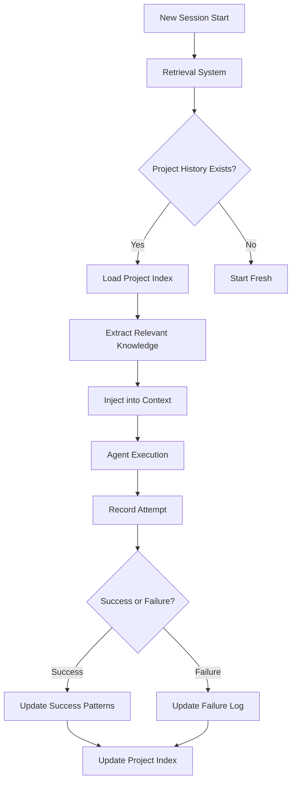

# PRD: Historical Retrieval System

**Version**: 1.0  
**Status**: Draft  
**Owner**: Autohand Team  
**Last Updated**: 2025-11-19

---

## Executive Summary

Build an intelligent retrieval system that learns from past attempts within a project, preventing the agent from repeating failed approaches and leveraging successful patterns. The system analyzes previous sessions, extracts key learnings, and automatically injects relevant context when starting new sessions.

---

## Problem Statement

### Current Limitations
1. **Repeated Failures**: Agent tries the same broken approach multiple times
2. **Lost Knowledge**: Successful solutions from past sessions are forgotten
3. **No Learning**: Each session starts from zero, ignoring project history
4. **Wasted Time**: Users manually explain "we already tried that and it didn't work"

### Real-World Example
```
Session 1 (Yesterday):
User: "Add Redis caching"
Agent: Tries to install redis-node (fails - wrong package)

Session 2 (Today):
User: "Add Redis caching"
Agent: Tries to install redis-node again (same failure)
```

**Desired Behavior:**
```
Session 2 (Today):
User: "Add Redis caching"
Agent: "I see we attempted this yesterday. The redis-node package 
       failed to install. I'll try ioredis instead, which is the 
       recommended Node client."
```

---

## Goals & Success Metrics

### Primary Goals
1. **Anti-Pattern Detection**: Never repeat documented failures
2. **Knowledge Reuse**: Surface successful patterns from history
3. **Context Awareness**: Start new sessions with project-specific insights
4. **Failure Attribution**: Track what failed and why

### Success Metrics
- 80% reduction in repeated failed attempts
- 50% faster task completion for recurring tasks
- User feedback: "Feels like the agent remembers our project"
- Zero false positives (blocking valid approaches due to stale history)

---

## User Stories

### Story 1: Avoid Repeated Failures
**As a** developer  
**I want** the agent to remember failed attempts  
**So that** it doesn't waste time trying the same thing again

**Acceptance Criteria:**
- Failed tool calls are recorded with reason
- New sessions check history before attempting similar actions
- Agent explains: "This was tried before and failed because..."

### Story 2: Leverage Past Success
**As a** developer  
**I want** successful patterns to be reused  
**So that** the agent becomes more effective over time

**Acceptance Criteria:**
- Working solutions (tests passed, build succeeded) are indexed
- Agent suggests: "Based on previous work, I'll use this approach..."
- Successful file patterns/commands are prioritized

### Story 3: Project Context Synthesis
**As a** developer  
**I want** new sessions to automatically understand project patterns  
**So that** I don't re-explain the same context

**Acceptance Criteria:**
- First message in new session includes "Based on 3 previous sessions..."
- Project-specific knowledge (tech stack, conventions) is pre-loaded
- User can ask "What have we worked on?" and get a summary

---

## Technical Design

### System Architecture



### Storage Structure

```
~/.autohand-cli/
├── projects/
│   ├── <project-hash>/
│   │   ├── index.json              # Project metadata
│   │   ├── knowledge.json          # Synthesized knowledge
│   │   ├── failures.jsonl          # Failed attempts log
│   │   ├── successes.jsonl         # Successful patterns
│   │   └── sessions/
│   │       ├── 2025-11-19_abc123 -> ../../../../sessions/2025-11-19_abc123/
│   │       └── 2025-11-18_def456 -> ../../../../sessions/2025-11-18_def456/
```

### Schema Definitions

#### `index.json` (Project Metadata)
```json
{
  "projectPath": "/Users/name/my-app",
  "projectHash": "a7b3c2d4",
  "displayName": "my-app",
  "firstSeen": "2025-11-15T10:00:00Z",
  "lastActiveAt": "2025-11-19T14:32:00Z",
  "sessionCount": 5,
  "techStack": {
    "languages": ["TypeScript", "Python"],
    "frameworks": ["React", "FastAPI"],
    "tools": ["Bun", "pytest", "vite"]
  },
  "patterns": {
    "testCommand": "bun test",
    "buildCommand": "bun run build",
    "packageManager": "bun"
  }
}
```

#### `failures.jsonl` (Failed Attempts)
```jsonl
{"timestamp":"2025-11-18T15:30:00Z","sessionId":"2025-11-18_def456","tool":"run_command","command":"npm install redis-node","error":"Package not found","context":"Adding Redis caching","tags":["dependency","redis"]}
{"timestamp":"2025-11-19T09:15:00Z","sessionId":"2025-11-19_abc123","tool":"test_run","error":"ModuleNotFoundError: dotenv","context":"Running tests","tags":["testing","missing-dep"]}
```

#### `successes.jsonl` (Successful Patterns)
```jsonl
{"timestamp":"2025-11-18T16:00:00Z","sessionId":"2025-11-18_def456","tool":"run_command","command":"bun add ioredis","result":"Successfully installed","context":"Adding Redis caching","tags":["dependency","redis"]}
{"timestamp":"2025-11-19T10:30:00Z","sessionId":"2025-11-19_abc123","pattern":"test_before_commit","description":"Always run tests before git commit","tags":["workflow","testing"]}
```

#### `knowledge.json` (Synthesized Insights)
```json
{
  "updatedAt": "2025-11-19T14:32:00Z",
  "summary": "React + TypeScript app with FastAPI backend. Uses Bun for package management. Redis for caching (ioredis client). Tests required before commits.",
  "antiPatterns": [
    {
      "pattern": "npm install redis-node",
      "reason": "Package doesn't exist, use ioredis",
      "occurredAt": "2025-11-18T15:30:00Z"
    }
  ],
  "bestPractices": [
    {
      "pattern": "Run 'bun test' before commits",
      "reason": "Project has pre-commit hook",
      "confidence": 0.95
    }
  ],
  "conventions": {
    "testPattern": "*.test.ts",
    "importStyle": "ES modules",
    "formatter": "prettier"
  }
}
```

---

## Retrieval Algorithms

### 1. Failure De-duplication

Before executing a tool call, check if a similar action failed recently:

```typescript
function isDuplicateFailure(toolCall: ToolCall): FailureMatch | null {
  const recentFailures = loadFailures(projectHash, { last: '7d' });
  
  for (const failure of recentFailures) {
    if (similarityScore(toolCall, failure) > 0.85) {
      return {
        originalFailure: failure,
        confidence: 0.92,
        recommendation: "Try alternative approach"
      };
    }
  }
  
  return null;
}
```

**Similarity Scoring:**
- Same tool type: +0.3
- Similar command/path: +0.4 (fuzzy match)
- Similar context/tags: +0.3

### 2. Success Pattern Matching

When planning an action, check for successful patterns:

```typescript
function findSuccessPattern(intent: string): SuccessPattern | null {
  const successes = loadSuccesses(projectHash);
  const matches = successes.filter(s => 
    s.tags.some(tag => intent.includes(tag)) &&
    s.confidence > 0.7
  );
  
  return matches.sort((a, b) => b.timestamp - a.timestamp)[0] || null;
}
```

### 3. Knowledge Injection

At session start, inject synthesized knowledge into system prompt:

```typescript
function buildProjectContext(projectHash: string): string {
  const knowledge = loadKnowledge(projectHash);
  
  return `
## Project Context (from ${knowledge.sessionCount} previous sessions)

**Summary:** ${knowledge.summary}

**Anti-Patterns to Avoid:**
${knowledge.antiPatterns.map(ap => 
  `- ❌ ${ap.pattern}: ${ap.reason}`
).join('\n')}

**Known Successful Patterns:**
${knowledge.bestPractices.map(bp => 
  `- ✅ ${bp.pattern}: ${bp.reason}`
).join('\n')}

**Tech Stack:** ${Object.entries(knowledge.techStack).map(([k, v]) => 
  `${k}: ${v.join(', ')}`
).join(' | ')}
`;
}
```

---

## Recording System

### When to Record

| Event | Record To | Data Captured |
|-------|-----------|---------------|
| Tool call succeeds | `successes.jsonl` | Tool, args, result, context |
| Tool call fails | `failures.jsonl` | Tool, args, error, context |
| Test passes | `successes.jsonl` | Test command, files, duration |
| Build succeeds | `successes.jsonl` | Build command, output |
| Commit made | `successes.jsonl` | Commit message, files changed |
| User says "that worked" | `successes.jsonl` | Previous action + context |
| User says "try again" / "that failed" | `failures.jsonl` | Previous action + reason |

### Auto-Tagging

Extract tags from context:
- **Intent**: "adding auth" → `["authentication", "security"]`
- **Tech**: "install ioredis" → `["dependency", "redis", "database"]`
- **Tool**: `test_run` → `["testing"]`
- **File**: `src/auth/jwt.ts` → `["auth", "jwt", "backend"]`

---

## User Interface

### Session Start Message

```
> Autohand v0.1.0
model: anthropic/claude-3.5-sonnet  | directory: /Users/name/my-app

📚 Loading project knowledge from 3 previous sessions...

✅ Found 8 successful patterns
⚠️  Found 2 failed attempts to avoid

Summary: React + TypeScript app with FastAPI backend. Uses Bun for 
package management. Redis caching via ioredis. Tests required before commits.

› 
```

### Warning Before Duplicate Failure

```
User: "Install redis-node package"

Agent:
⚠️  Historical Context
I see this was attempted on 2025-11-18 and failed:
  "Package redis-node not found"
  
I recommend using `ioredis` instead, which worked successfully in that session.

Proceed with redis-node anyway? (y/n)
```

### Success Pattern Suggestion

```
User: "Add caching to the API"

Agent:
💡 Based on previous work (2025-11-18), I'll use ioredis for caching since
   that worked well with this stack. I'll follow the same pattern:
   
   1. Install ioredis
   2. Create Redis client in src/cache/redis.ts
   3. Add connection to startup
   
   Does this approach sound good?
```

---

## Configuration

Add to `config.json`:
```json
{
  "retrieval": {
    "enabled": true,
    "autoInject": true,              // Inject knowledge at session start
    "warnOnDuplicateFailure": true,  // Warn before repeating failures
    "failureLookbackDays": 7,        // How far back to check failures
    "minConfidence": 0.75,           // Minimum confidence to suggest pattern
    "maxContextSize": 2000           // Max chars of historical context
  }
}
```

---

## Privacy & Security

### Sensitive Data Handling
- Filter out API keys, tokens, passwords from recorded commands
- Redact sensitive file paths (e.g., `/Users/<username>/` → `/Users/*/`)
- Option to disable recording for specific projects

### Data Retention
- Failures older than 30 days are archived (not actively retrieved)
- Successes are kept indefinitely (contribute to knowledge base)
- Users can manually delete project history

---

## Performance

### Benchmarks (Target)
- Knowledge synthesis: < 100ms per session
- Failure lookup: < 50ms per tool call
- Context injection overhead: < 200ms at session start

### Optimization
1. In-memory cache of active project knowledge
2. Bloom filter for fast "have we seen this before?"
3. Async background indexing (doesn't block agent)

---

## Rollout Plan

### Phase 1: Recording (Week 1)
- Record all tool call results (success/failure)
- Build project index
- No retrieval yet (just logging)

### Phase 2: Anti-Pattern Detection (Week 2)
- Implement failure lookup
- Warn before duplicate failures
- User can override warnings

### Phase 3: Knowledge Synthesis (Week 3)
- Build synthesized knowledge from history
- Inject at session start
- Success pattern suggestions

### Phase 4: Advanced Features (Future)
- Cross-project learning (find similar solutions in other projects)
- Collaborative knowledge (share anonymized patterns)
- ML-based pattern extraction

---

## Open Questions

1. **How to handle changing requirements?**
   - What failed last week might work now (e.g., package is published)
   - Solution: Time-decay confidence, allow manual overrides

2. **How to detect false positives?**
   - System blocks valid approach due to old failure
   - Solution: Always allow override, track override success rate

3. **Should we learn across projects?**
   - Pro: More data, better patterns
   - Con: Leaks info between projects, complexity
   - Decision: Phase 4 (opt-in)

4. **How to handle git branch switches?**
   - Different branches might have different patterns
   - Solution: Track per-branch (future enhancement)

---

## Success Criteria

### Must Have
- [x] Record failures with context
- [x] Warn before duplicate failures
- [x] Inject project knowledge at session start
- [x] "What have we worked on?" command

### Nice to Have
- [ ] Success pattern suggestions during execution
- [ ] Cross-session learning (identify recurring tasks)
- [ ] Visual timeline of project evolution

### Won't Have (V1)
- Cross-project learning
- ML-based pattern extraction
- Real-time collaboration

---

## Example Workflow

```
Day 1, Session 1:
User: "Add authentication"
Agent: [tries various approaches, some fail, finally JWT works]
System: Records 3 failures, 1 success

Day 2, Session 1:
System: "Based on yesterday's session: JWT auth implemented successfully"
User: "Add authorization middleware"
Agent: "I'll follow the JWT pattern we used for auth..."

Day 3, Session 1:
User: "Add authentication" (forgot it's done)
Agent: "Authentication was already added on Day 1 using JWT. 
       Would you like to modify it or add something else?"
```

This shows the system preventing:
1. Repeated failures (tries wrong approaches)
2. Duplicate work (re-implementing existing features)
3. Context loss (remembers project state)
