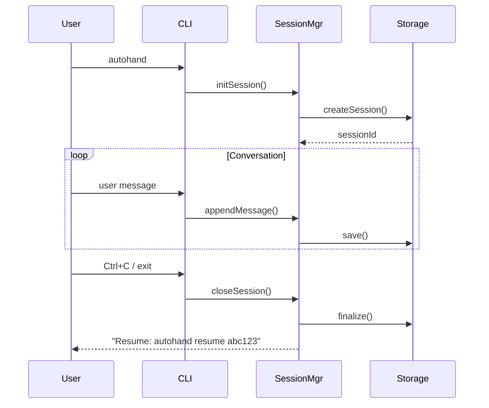

# PRD: Session Persistence System

**Version**: 1.0  
**Status**: Draft  
**Owner**: Autohand Team  
**Last Updated**: 2025-11-19

---

## Executive Summary

Enable Autohand CLI to persist conversation history across sessions, allowing users to resume work seamlessly and maintain context over multiple interactions. Sessions are stored in `~/.autohand-cli/sessions/` with unique IDs and can be resumed with `autohand resume <session-id>`.

---

## Problem Statement

### Current Limitations
1. **Lost Context**: Each CLI invocation starts fresh, losing all conversation history
2. **Interrupted Work**: Users can't continue where they left off after closing the terminal
3. **No History**: Previous interactions aren't accessible for reference
4. **Wasted Repetition**: Users re-explain context in new sessions

### User Pain Points
- "I closed my terminal and lost all the progress"
- "I need to re-explain the entire project structure every time"
- "The agent doesn't remember what we discussed yesterday"

---

## Goals & Success Metrics

### Primary Goals
1. Persist conversation history automatically on every interaction
2. Enable session resumption with minimal friction
3. Provide clear session identification and management

### Success Metrics
- 90% of sessions successfully persist and resume
- Average resume time < 2 seconds
- Zero data loss on normal exit
- User satisfaction: "Makes Autohand feel stateful"

---

## User Stories

### Story 1: Automatic Session Creation
**As a** developer  
**I want** my CLI session to be automatically saved  
**So that** I never lose my work when I close the terminal

**Acceptance Criteria:**
- Session created on first user interaction
- Conversation saved after each turn (user message + AI response)
- Session metadata updated continuously

### Story 2: Seamless Resume
**As a** developer  
**I want** to resume my last session easily  
**So that** I can continue where I left off

**Acceptance Criteria:**
- `autohand resume <session-id>` loads full history
- Exit message displays session ID and resume command
- Previous context (files, workspace state) is restored

### Story 3: Session Discovery
**As a** developer  
**I want** to see all my past sessions  
**So that** I can find and resume relevant work

**Acceptance Criteria:**
- `autohand sessions` lists all sessions with metadata
- `autohand sessions --project <path>` filters by project
- Display shows: ID, date, project, summary, message count

---

## Technical Design

### Session Lifecycle



### Storage Structure

```
~/.autohand-cli/
├── sessions/
│   ├── index.json                    # Session index
│   ├── 2025-11-19_abc123/
│   │   ├── metadata.json            # Session metadata
│   │   ├── conversation.jsonl       # Messages (JSONL format)
│   │   └── state.json               # Workspace state snapshot
│   ├── 2025-11-18_def456/
│   │   ├── metadata.json
│   │   ├── conversation.jsonl
│   │   └── state.json
```

#### `metadata.json` Schema
```json
{
  "sessionId": "2025-11-19_abc123",
  "createdAt": "2025-11-19T13:28:00Z",
  "lastActiveAt": "2025-11-19T14:32:00Z",
  "closedAt": "2025-11-19T14:32:00Z",
  "projectPath": "/Users/name/project",
  "projectName": "my-app",
  "model": "anthropic/claude-3.5-sonnet",
  "messageCount": 15,
  "summary": "Implemented user authentication with JWT",
  "status": "completed" | "active" | "crashed",
  "exitCode": 0
}
```

#### `conversation.jsonl` Format
Each line is a JSON object:
```jsonl
{"role":"user","content":"Add JWT auth","timestamp":"2025-11-19T13:28:10Z"}
{"role":"assistant","content":"I'll implement JWT...","timestamp":"2025-11-19T13:28:15Z","toolCalls":[...]}
```

#### `state.json` Schema
```json
{
  "workspaceRoot": "/Users/name/project",
  "workspaceFiles": ["src/index.ts", "..."],
  "gitStatus": "## main\n M src/auth.ts",
  "contextUsed": 15000,
  "contextLimit": 200000
}
```

#### `index.json` (Fast Lookup)
```json
{
  "sessions": [
    {
      "id": "2025-11-19_abc123",
      "projectPath": "/Users/name/project",
      "createdAt": "2025-11-19T13:28:00Z",
      "summary": "Auth implementation"
    }
  ],
  "byProject": {
    "/Users/name/project": ["2025-11-19_abc123", "2025-11-18_def456"]
  }
}
```

### Session ID Format
- Format: `YYYY-MM-DD_<short-hash>`
- Example: `2025-11-19_a7b3c2`
- Short hash: First 6 chars of SHA-256(timestamp + random)
- Collision probability: ~1 in 16 million per day

### API Design

```typescript
class SessionManager {
  // Core operations
  createSession(projectPath: string): Session;
  loadSession(sessionId: string): Session;
  appendMessage(role: 'user' | 'assistant', content: string, meta?: object): void;
  updateState(state: WorkspaceState): void;
  closeSession(summary?: string): void;
  
  // Discovery
  listSessions(filter?: { project?: string; since?: Date }): SessionMetadata[];
  getLastSession(projectPath?: string): SessionMetadata | null;
  
  // Maintenance
  deleteSession(sessionId: string): void;
  pruneOldSessions(olderThan: Date): number;
}

class Session {
  id: string;
  metadata: SessionMetadata;
  messages: Message[];
  state: WorkspaceState;
  
  append(message: Message): void;
  save(): Promise<void>;
  close(summary?: string): Promise<void>;
}
```

---

## CLI Integration

### New Commands

#### `autohand resume <session-id>`
```bash
$ autohand resume 2025-11-19_abc123

⢀⡴⠛⠛⠻⣷⡄ ...
> Autohand v0.1.0

📂 Resuming session 2025-11-19_abc123
   Project: /Users/name/my-app
   Started: 2025-11-19 13:28
   Messages: 15

[Previous conversation history displayed]
Last assistant: "I've implemented JWT auth..."

› 
```

#### `autohand sessions [--project <path>]`
```bash
$ autohand sessions --project ~/my-app

Sessions for /Users/name/my-app:

 ID                    Created              Messages  Summary
 2025-11-19_abc123    Nov 19, 2:28pm      15        Auth implementation
 2025-11-18_def456    Nov 18, 4:15pm      8         Bug fixes
 2025-11-17_ghi789    Nov 17, 10:30am     23        Initial setup

Use `autohand resume <id>` to continue
```

### Exit Message Enhancement

**Before:**
```
Ending Autohand session.
```

**After:**
```
Ending Autohand session.

💾 Session saved: 2025-11-19_abc123
   Resume with: autohand resume 2025-11-19_abc123
```

### `/new` Command Behavior
Currently: Clears conversation in memory  
**New**: Also closes current session and creates a new one

---

## Configuration

Add to `config.json`:
```json
{
  "session": {
    "enabled": true,
    "autoSave": true,
    "saveInterval": 5000,          // ms between saves
    "maxStorageMB": 500,            // Max total storage
    "retentionDays": 30,            // Auto-delete after N days
    "resumeLastOnStart": false      // Auto-resume last session
  }
}
```

---

## Error Handling

### Failure Scenarios

| Scenario | Behavior | User Message |
|----------|----------|--------------|
| Session file corrupted | Create new session | ⚠️ Previous session corrupted, starting fresh |
| Disk full | Continue without saving | ⚠️ Session saving disabled (disk full) |
| Permission denied | Continue without saving | ⚠️ Can't write to ~/. autohand-cli/ |
| Session ID collision | Append random suffix | (Silent, retry with new ID) |
| Resume non-existent ID | Error | ❌ Session not found: abc123 |

---

## Privacy & Security

### Data Sensitivity
- Sessions may contain sensitive code, API keys, credentials
- Stored in user's home directory (not shared)
- No encryption by default (user's filesystem security)

### Recommendations
1. Add `.autohand-cli/` to `.gitignore` globally
2. Document security implications in README
3. Future: Optional encryption with user passphrase

---

## Performance

### Benchmarks (Target)
- Session creation: < 10ms
- Append message: < 5ms
- Load session: < 500ms (100 messages)
- List sessions: < 100ms (1000 sessions)

### Optimization Strategies
1. Use JSONL for append-only writes (no re-parsing)
2. Index file for fast lookup
3. Lazy-load conversation history (paginated)
4. Background save with debouncing

---

## Migration & Rollout

### Phase 1: Foundation (Week 1)
- Implement `SessionManager` class
- Basic persistence (create, append, load)
- CLI integration (automatic session creation)

### Phase 2: Resume (Week 2)
- `resume` command
- Exit messages with session ID
- Session listing

### Phase 3: Enhancement (Week 3)
- `/new` integration
- Auto-resume option
- Maintenance commands (prune, delete)

### Backward Compatibility
- Optional feature (config flag)
- Graceful degradation if disabled
- No breaking changes to existing commands

---

## Open Questions

1. **Should we auto-resume the last session by default?**
   - Pro: Seamless continuity
   - Con: Might be confusing if user expects fresh start

2. **How should we handle git branch switches?**
   - Option A: Continue session (branch is just state)
   - Option B: Suggest creating new session

3. **Conversation history display on resume?**
   - Option A: Full replay (slow)
   - Option B: Summary + last N messages
   - Option C: Silent load (just restore state)

---

## Future Enhancements

1. **Session Export/Import**: Share sessions between machines
2. **Session Branching**: Fork a session to explore alternatives
3. **Session Merge**: Combine learnings from multiple sessions
4. **Cloud Sync**: Optional sync to cloud storage
5. **Session Search**: Full-text search across all sessions
6. **Session Diff**: Compare two sessions side-by-side
